# Projeto de Implantação de Ambiente na AWS com Docker e WordPress


## 1. Introdução

Este projeto descreve a implantação de um ambiente AWS para hospedar uma aplicação WordPress com MySQL. A infraestrutura foi configurada com uma VPC padrão contendo NAT Gateway, duas zonas de disponibilidade (A e B), e subnets públicas e privadas para escalabilidade e segurança.

---
# Meu Projeto

<p align="center">
  
</p>

## Introdução

Este projeto visa a configuração de um ambiente na AWS para hospedar uma aplicação WordPress com MySQL como backend. A infraestrutura será montada usando **EC2**, **EFS** para armazenamento de arquivos estáticos, **RDS** para o banco de dados, e **Load Balancer** para distribuição de tráfego.

## Passos

1. Configurar VPC
2. Configurar EFS.
3. Configurar RDS.
4. Criar instância EC2.
5. Instalar Docker.
6. Configurar Load Balancer.
7. Auto Scaling
8. Fui de cama desgraça!!!

## Recursos

<p align="center">
  
</p>

Para mais informações, visite [Documentação Oficial da AWS](https://aws.amazon.com/documentation/).


## 2. Requisitos

- Conta AWS com permissões administrativas.
- Conhecimento básico em Docker, WordPress, e AWS CLI.
- Ferramentas instaladas:
  - Docker e Docker Compose na instância EC2.
  - nfs-common para montar o EFS.

---

## Etapas para Criar uma VPC para Load Balancer

### Criar a VPC

- Acesse o AWS Management Console e navegue até o serviço VPC.
- Clique em Create VPC.

Preencha os detalhes:  

Nome da sua VPC (por exemplo, minha-vpc).
IPv4 CIDR block: Especifique um intervalo de IP (ex.: 10.0.0.0/16).
Tenancy: Deixe como Default.
Clique em Create VPC.

---

### 2. Criar Subnets
O Load Balancer precisa de subnets públicas para acessar a internet e privadas para os recursos internos.

### Crie subnets públicas:

  Vá em Subnets e clique em Create Subnet.
  Selecione a VPC criada anteriormente.
  Escolha uma Availability Zone (ex.: us-east-1a).
  Adicione um CIDR block para a subnet (ex.: 10.0.1.0/24).
  Marque a opção Auto-assign public IPv4.
  Repita o processo para outra zona de disponibilidade (ex.: us-east-1b).
  
### Crie subnets privadas:

  - *Siga o mesmo processo das subnets públicas, mas sem ativar a opção de IP   
    público.
   
  - *Use intervalos de CIDR diferentes (ex.: 10.0.2.0/24 e 10.0.3.0/24).
  
### Configurar o Internet Gateway
   Vá em Internet Gateways e clique em Create internet gateway.
   Nomeie o gateway e clique em Create.
   Anexe o Internet Gateway à sua VPC:
    Selecione o gateway criado, clique em Actions → Attach to VPC, e escolha sua 
    VPC.
    
### Configurar Tabelas de Roteamento
   Vá em Route Tables e selecione a tabela de roteamento associada à sua VPC.
   
   Para subnets públicas:
       Adicione uma rota para a internet:
       Destination: 0.0.0.0/0.
       Target: O Internet Gateway criado.
    Associe a tabela às subnets públicas.
    
   Para subnets privadas:
      Certifique-se de que as subnets privadas utilizam um NAT Gateway.
      
### Criar o NAT Gateway
    Vá em NAT Gateways e clique em Create NAT Gateway.
    Escolha uma subnet pública e associe um Elastic IP.
    Após criar o NAT Gateway, configure uma tabela de roteamento para as subnets 
    privadas:
    Destination: 0.0.0.0/0.
    Target: O NAT Gateway criado.

### Estrutura da VPC

### Configuração Geral
- **VPC:** Padrão, com NAT Gateway configurado.
- **Zonas de Disponibilidade:** `us-east-1a` e `us-east-1b`.
- **Subnets:** 
  - 2 públicas para recursos expostos (Load Balancer e NAT Gateway).
  - 2 privadas para instâncias EC2 e RDS.

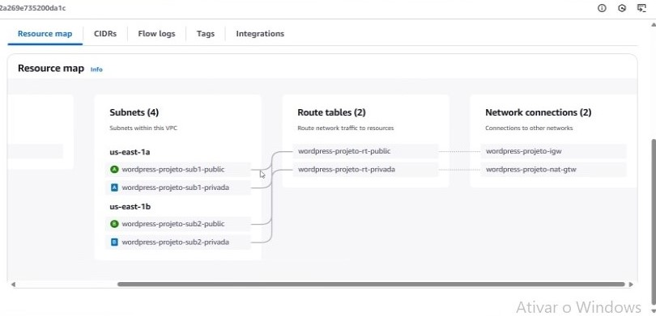

#### Subnets Configuradas:
| Subnet        | Tipo       | Zona de Disponibilidade | Tabela de Roteamento   |
|---------------|------------|-------------------------|------------------------|
| Public Subnet | Pública    | `us-east-1a`           | Internet Gateway       |
| Public Subnet | Pública    | `us-east-1b`           | Internet Gateway       |
| Private Subnet| Privada    | `us-east-1a`           | NAT Gateway            |
| Private Subnet| Privada    | `us-east-1b`           | NAT Gateway            |

#### Pontos Importantes:
1. **NAT Gateway:** Permite que instâncias em subnets privadas acessem a internet para atualizações e downloads.
2. **Security Groups:** Configurados para restringir acessos aos serviços críticos.

---

## Componentes da Infraestrutura

### Security grups (Grupos de segura) Firewall

O Security Group, no contexto da AWS (Amazon Web Services), atua como um firewall virtual para controlar o tráfego de entrada e saída das instâncias EC2 (Elastic Compute Cloud). Aqui está uma descrição detalhada da sua função:


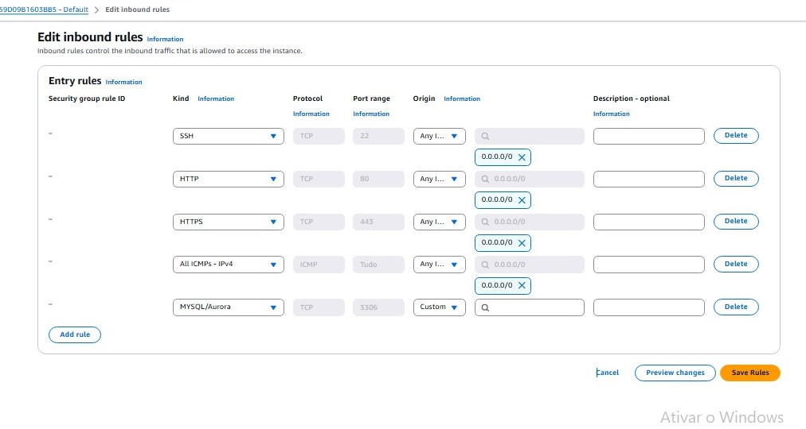

**Resumo:** 

**Segurança:** Protege suas instâncias EC2 controlando o tráfego de rede.

**Flexibilidade:** Permite configurações específicas para diferentes tipos de tráfego.

**Stateful:** Regras stateful facilitam a gestão do tráfego de resposta.

**Links Úteis**

- [Documentação Oficial dos Security Groups da AWS](https://docs.aws.amazon.com/pt_br/vpc/latest/userguide/VPC_SecurityGroups.html)


Os Security Groups são essenciais para manter a segurança e a integridade das suas instâncias na AWS. Se precisar de mais detalhes ou exemplos específicos, estou aqui para ajudar!

### 4.2 EFS
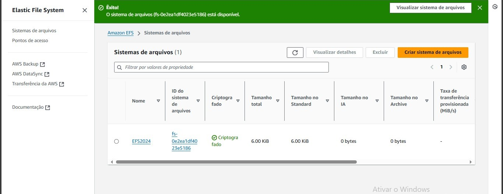

- **Uso:** Armazenamento persistente para arquivos WordPress.
- **Montagem:** Configurado em `/mnt/efs` na instância EC2.
- 
1 Na barra de pesquisa, digite EFS e clique no serviço Elastic File System.
  
2. Criar o File System
No painel do EFS, clique em Create file system.
Insira um nome para o sistema de arquivos (ex.: my-efs).
Escolha a VPC onde o EFS será configurado.
Clique em Create para criar o EFS com as configurações padrão.
O sistema será criado com as subnets disponíveis na VPC selecionada.

2. Configurar o EFS
Após criar o EFS, configure as opções de rede e segurança:

- a. Configuração de Rede
No painel do EFS, clique no sistema de arquivos recém-criado.
Vá para a aba Network e configure os Mount Targets:
Verifique se cada subnet associada ao EFS está configurada.
Certifique-se de que os Security Groups associados permitem o tráfego NFS:
Adicione uma regra no Security Group para permitir tráfego na porta 2049 (protocolo NFS).

- b. Configuração do Access Point (opcional)
Na aba Access Points, clique em Create Access Point.
Configure permissões e diretórios padrão (ex.: /efs-data).
Clique em Create.

### Montar o EFS na Instância EC2
- a. Instale o Cliente NFS
Certifique-se de que o cliente NFS está instalado na instância EC2:
```
sudo apt update
sudo apt install -y nfs-common
sudo mkdir -p /efs/wordpress
```
- b. Monte o EFS
No console EFS, clique em Attach no sistema de arquivos.
Copie o comando de montagem gerado (exemplo):
```
sudo mount -t nfs -o vers=4.1 fs-<ID>.efs.<região>.amazonaws.com:/ /mnt/efs
```
Crie o ponto de montagem na EC2: (modifique o caminho)
``` 
sudo mkdir -p /mnt/efs
sudo mount -t nfs -o vers=4.1 fs-<ID-EFS>.efs.<REGIÃO>.amazonaws.com:/ /efs/wordpress
```
- c. Persistência de Montagem
Adicione o EFS ao arquivo /etc/fstab para montagem automática:

echo "fs-<ID-EFS>.efs.<REGIÃO>.amazonaws.com:/ /mnt/efs nfs defaults 0 0" | sudo tee -a /etc/fstab

### Testar o EFS
Navegue até o ponto de montagem:
```
cd /mnt/efs
# Crie um arquivo de teste:

sudo touch test-file.txt
ls -l
```
Se o arquivo for criado com sucesso, o EFS está funcionando corretamente.

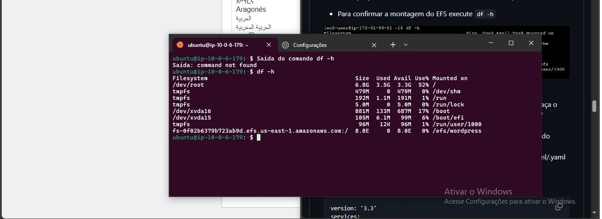

<i>Dicas e Boas Práticas
Performance Modes:
General Purpose: Para uso geral.
Max I/O: Para sistemas com altas taxas de throughput.
Throughput Modes:
Bursting: Escala automaticamente com base no uso.
Provisioned: Para throughput consistente.
Backup e Segurança:
Use o AWS Backup para snapshots automáticos.
Configure regras de segurança nos Security Groups.
</i>
### RDS ( BANCO DE DADOS )

- **Banco de Dados:** MySQL.
- **Segurança:** Acesso restrito às subnets privadas.
- **Public Access:** Desativado para maior segurança.
  
Passo 1: Acessar o Console da AWS
Acesse o Console da AWS:

Entre no console da AWS e vá para o serviço RDS.

Passo 2: Criar uma Instância de Banco de Dados
Navegar até Instâncias de Banco de Dados:

Clique em "Create database".

Escolher o Modo de Criação:

Selecione "Standard Create" para ter mais controle sobre as configurações.

Escolher o Mecanismo de Banco de Dados:

Selecione o mecanismo de banco de dados que deseja usar (por exemplo, MySQL, PostgreSQL, MariaDB, Oracle, SQL Server).

Escolher o Modelo:

Selecione "Free tier" se estiver usando a camada gratuita da AWS.

Passo 3: Configurar a Instância de Banco de Dados
Configurações da Instância:

DB Instance Identifier: Dê um nome à sua instância de banco de dados.

Master Username: Escolha um nome de usuário para o administrador do banco de dados.

Master Password: Defina uma senha para o administrador do banco de dados.

Configurações de Instância:

DB Instance Class: Selecione a classe da instância (por exemplo, db.t2.micropara a camada gratuita).

Storage: Defina o armazenamento (por exemplo, 20 GB).

Configurações de Conectividade:

VPC: Selecione a VPC onde a instância será criada.

Subnet Group: Selecione o grupo de sub-rede.

Public Access: Defina se a instância será acessível publicamente (recomendado desativar para maior segurança).

VPC Security Group: Selecione ou crie um grupo de segurança que permita o tráfego na porta 3306 (para MySQL).

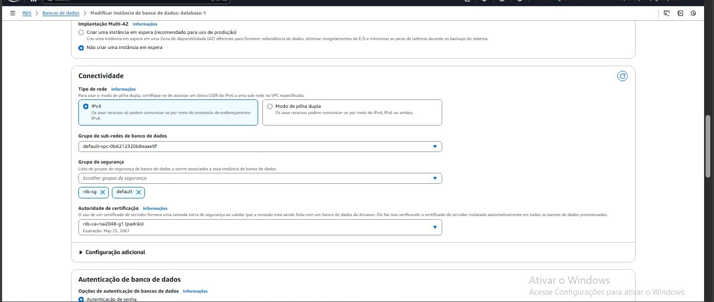

### Configurações Adicionais
Configurações de Banco de Dados:

Database Name: Dê um nome ao banco de dados.

Backup: Configure as opções de backup conforme necessário.

Monitoring: Ative o monitoramento aprimorado se necessário.

Maintenance: Configure a janela de manutenção.

Criar a Instância

Revisar e Criar:

Revise todas as configurações.

Clique em "Create database" para finalizar a criação.

### EC2
Passo a Passo para Criar uma Instância EC2


1. Acesse o Console AWS
Faça login no AWS Management Console.
Na barra de pesquisa, digite EC2 e clique no serviço EC2.

3. Iniciar o Assistente de Instância
No painel EC2, clique em Launch Instances.
Insira um Nome para a instância (ex.: my-web-server).

5. Escolher a Imagem da Instância (AMI)
Escolha a Amazon Machine Image (AMI):
Amazon Linux 2 (recomendado para geral).
Outras opções: Ubuntu, Windows Server, etc.
Clique em Select na imagem desejada.

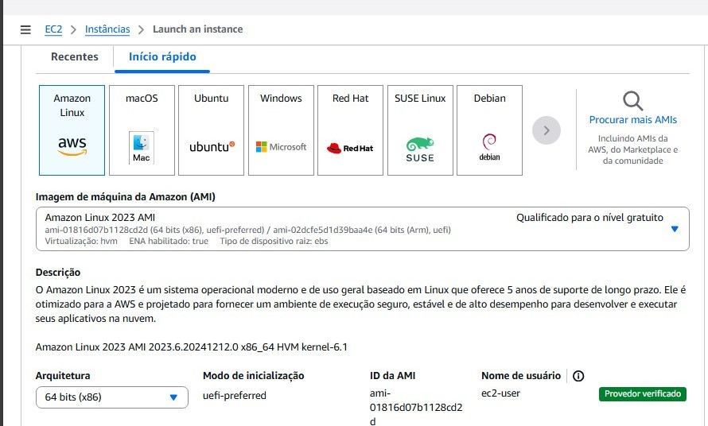

7. Escolher o Tipo da Instância
Escolha um tipo de instância, dependendo do uso:
t2.micro ou t3.micro para fins de teste ou elegibilidade ao Free Tier.
Instâncias maiores para cargas mais pesadas.
Clique em Next.

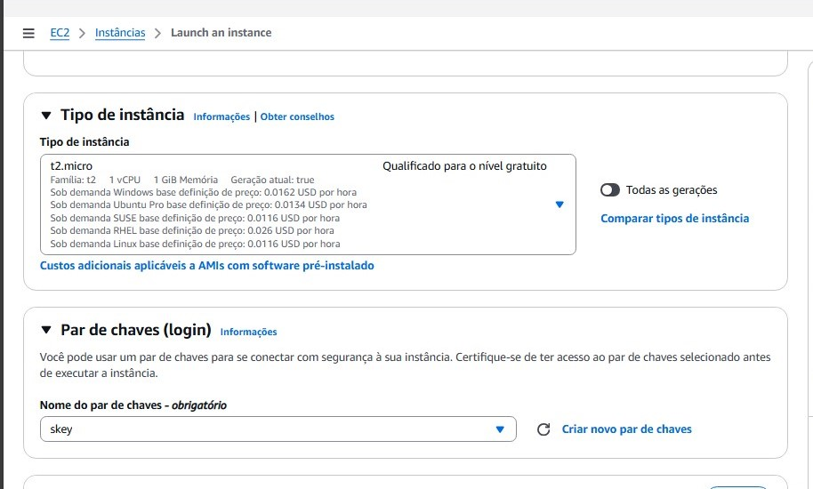

9. Configurar os Detalhes da Instância
Selecione a VPC e a Subnet apropriadas.
Auto-assign Public IP:
Ative para dar acesso à internet (em subnets públicas).

11. Adicionar Armazenamento
Configure o armazenamento:
Root Volume (Geral): 8 GiB padrão é suficiente para muitos casos.
Adicione volumes adicionais, se necessário.
Escolha o tipo de volume (ex.: General Purpose SSD - gp3).

13. Configurar Security Group
Crie um novo ou selecione um Security Group existente:
Porta 22 (SSH): Permitir o acesso do seu IP para gerenciamento.
Porta 80 (HTTP): Para servidores web.
Porta 443 (HTTPS): Para acesso seguro.
Adicione regras personalizadas conforme necessário.


15. Criar Key Pair (Par de Chaves)
Clique em Create Key Pair se ainda não tiver um.
Salve o arquivo .pem em um local seguro (você precisará dele para login via SSH).
Selecione o par de chaves criado.

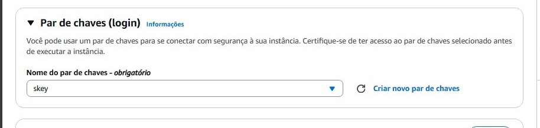


**Scripts de automação**

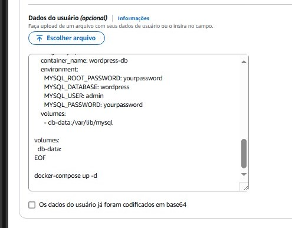

17. Revisar e Lançar
Revise todas as configurações.
Clique em Launch Instance.
Acesse a página de detalhes da instância para acompanhar o status.

19. Conectar à Instância
Após a inicialização, acesse a instância:
Clique em Connect no painel EC2.
Use o comando SSH fornecido:
Certifique-se de que as permissões do arquivo .pem estão configuradas:
chmod 400 your-key.pem
Use o comando SSH fornecido:
ssh -i "your-key.pem" ec2-user@your-public-ip

Acesse o terminal e use sua chave `chave.pem`
` sudo chmod 400 chave.pem `
SSH na instancia com comanado e ip  puclico da instancia
` sudo ssh -i "diretorio da chave.pem" ubuntu@ip da instancia `

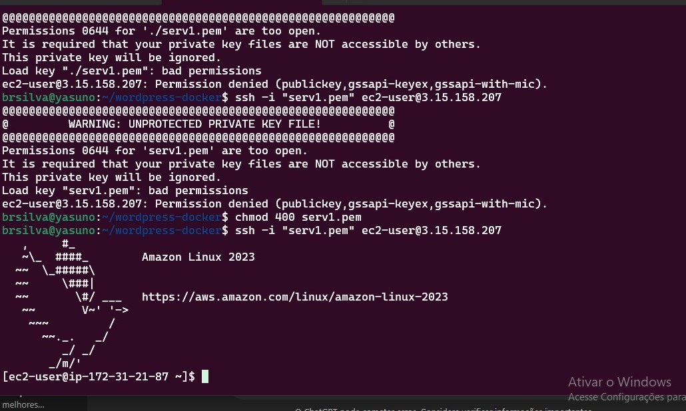
<p align="center"><i>Amazon linux 2023<i></p>


Dicas Adicionais
Snapshots: Tire snapshots do volume EBS para backup.
Elastic IP: Associe um Elastic IP à instância para um IP fixo.
Monitoramento: Habilite o CloudWatch para monitorar a performance da instância.

## 5. USER_DATA.SH


### Configuração do Docker Compose e wordpresss


### Na EC2 digite os comandos para o serviço `Wordpress`, crie o arquivo `docker-compose.yml`:

```
#!/bin/bash
 
# Atualiza o repositório de pacotes do sistema, e instala pacotes necessários para a instalação do Docker.

sudo apt update && apt upgrade -y

sudo apt-get install -y ca-certificates curl
 
# Cria o diretório onde as chaves GPG do repositório do Docker serão armazenadas

sudo install -m 0755 -d /etc/apt/keyrings
 
# Baixa a chave GPG oficial do docker e a salva no diretório criado e dá permissão para o usuário de leitura para a chave baixada

sudo curl -fsSL https://download.docker.com/linux/ubuntu/gpg -o /etc/apt/keyrings/docker.asc

sudo chmod a+r /etc/apt/keyrings/docker.asc
 
# Adiciona o repositório oficial do Docker, com a chave GPG para validar os pacotes.

echo \
  "deb [arch=$(dpkg --print-architecture) signed-by=/etc/apt/keyrings/docker.asc] https://download.docker.com/linux/ubuntu \
  $(. /etc/os-release && echo "$VERSION_CODENAME") stable" | \
  sudo tee /etc/apt/sources.list.d/docker.list > /dev/null
 
# Atualiza a lista de pacotes novamente.

sudo apt update
 
# Instalar a versão mais recente do Docker e dos seus componentes

sudo apt-get install -y docker-ce docker-ce-cli containerd.io docker-buildx-plugin docker-compose-plugin
 
# Inicia o Docker e troca suas permissões

sudo systemctl start docker
sudo systemctl enable docker
sudo usermod -aG docker ubuntu
 
# Configuração nfs

#instalar o nfs
sudo apt install nfs-common -y

#criar pasta para montar o efs
sudo mkdir -p /efs/wordpress

#montar o efs: 
sudo mount -t nfs4 -o nfsvers=4.1,rsize=1048576,wsize=1048576,hard,timeo=600,retrans=2,noresvport fs-0f02b6379b723ab9d.efs.us-east-1.amazonaws.com:/ /efs/wordpress

# Criar pasta para depositar docker compose.yml
sudo mkdir /projeto

# Entrar na pasta
cd /projeto
 
# Criação de docker compose

echo "version: '3.8'" >> docker-compose.yml && \
echo "services:" >> docker-compose.yml && \
echo "  wordpress:" >> docker-compose.yml && \
echo "    image: wordpress:latest" >> docker-compose.yml && \
echo "    ports:" >> docker-compose.yml && \
echo "      - 80:80" >> docker-compose.yml && \
echo "      - 443:443" >> docker-compose.yml && \
echo "    environment:" >> docker-compose.yml && \
echo "      WORDPRESS_DB_HOST: rds-server-test-03.ctrvlqjj9icq.us-east-1.rds.amazonaws.com" >> docker-compose.yml && \
echo "      WORDPRESS_DB_USER: admin" >> docker-compose.yml && \
echo "      WORDPRESS_DB_PASSWORD: WLWfsw6%%JZDnZPtaRNmJac*r" >> docker-compose.yml && \
echo "      WORDPRESS_DB_NAME: wordpress" >> docker-compose.yml && \
echo "    volumes:" >> docker-compose.yml && \
echo "      - /efs/wordpress:/var/www/html" >> docker-compose.yml

 
# iniciar o docker dentro de /projeto/
sudo docker compose up -d


```

### 4.4 Load Balancer
- **Tipo:** Application Load Balancer.
- **Função:** Distribuir tráfego para as instâncias EC2.
  Passo 1: Acessar o Console da AWS
Acesse o Console da AWS:

Entre no console da AWS e vá para o serviço EC2.

### Passo 2: Criar um Grupo de Alvo

Navegar até Grupos de Alvo:

No painel de navegação, selecione "Target Groups".

Clique em "Create target group".

Configurar o Grupo de Alvo:

Tipo de Alvo: Selecione "Instances".

Nome do Grupo de Alvo: Dê um nome ao grupo de alvo.

Protocolo: HTTP

Porta: 80

VPC: Selecione a VPC onde suas instâncias estão localizadas.

Health Checks: Configure as verificações de integridade conforme necessário.

Clique em "Next".

Registrar Alvos:

Selecione as instâncias EC2 que deseja registrar no grupo de alvo.

Clique em "Include as pending below".

Clique em "Create target group".

### Passo 3: Criar o Load Balancer

Navegar até Load Balancers:

No painel de navegação, selecione "Load Balancers".

Clique em "Create Load Balancer".

Escolher o Tipo de Load Balancer:

Selecione "Application Load Balancer".

Clique em "Create".

Configurar o Load Balancer:

Nome: Dê um nome ao Load Balancer.

Esquema: Selecione "Internet-facing" para tráfego público.

IP Address Type: IPv4

VPC: Selecione a VPC onde suas instâncias estão localizadas.

Subnets: Selecione pelo menos duas sub-redes públicas em diferentes zonas de disponibilidade.

Clique em "Next: Configure Security Settings".

Configurar Grupos de Segurança:

Selecione um grupo de segurança existente ou crie um novo grupo de segurança que permita tráfego HTTP (porta 80) e HTTPS (porta 443).

Clique em "Next: Configure Routing".

Configurar o Roteamento:

Target Group: Selecione o grupo de alvo criado anteriormente.

Clique em "Next: Register Targets".

Registrar Alvos:

Verifique se as instâncias EC2 estão registradas no grupo de alvo.

Clique em "Next: Review".

Revisar e Criar:

Revise todas as configurações.

Clique em "Create" para finalizar a criação do Load Balancer.

### Passo 4: Testar o Load Balancer
Obter o DNS do Load Balancer:

No console da AWS, vá para "Load Balancers".

Selecione o Load Balancer criado e copie o DNS name.

Testar no Navegador:

Abra um navegador e acesse o DNS name do Load Balancer.

Verifique se o tráfego está sendo distribuído corretamente para as instâncias EC2.

---
## Passo a Passo para Configurar o Auto Scaling pelo Console AWS

### Criar uma Launch Template
Acesse o Console da AWS:

Faça login no Console de Gerenciamento da AWS.

Navegue até EC2:

No menu de serviços, selecione EC2.

Crie uma Launch Template:

No painel de navegação, clique em Launch Templates.

Clique em Create launch template.

Dê um nome à sua launch template e configure as especificações das instâncias, como a imagem AMI, tipo de instância, VPC, e outras configurações necessárias.

Clique em Create launch template.

### Criar um Auto Scaling Group
Navegue até Auto Scaling Groups:

No painel de navegação do EC2, clique em Auto Scaling Groups.

Criar um Novo Auto Scaling Group:

Clique em Create Auto Scaling group.

Selecione a launch template que você criou anteriormente.

Dê um nome ao Auto Scaling group.

Configurar a Capacidade do Grupo:

Defina a Capacidade Desejada, Capacidade Mínima e Capacidade Máxima de instâncias.

Configurar a Rede e Sub-redes:

Selecione a VPC e sub-redes onde as instâncias irão rodar.

Configurar Regras de Segurança (Security Groups):

Selecione ou crie regras de segurança que controlam o tráfego de rede para suas instâncias.

Adicionar Load Balancing (Opcional):

Se desejar, você pode associar um Load Balancer para distribuir o tráfego entre as instâncias.

Configurar Regras de Verificação de Saúde:

Defina as verificações de saúde que determinam se as instâncias estão funcionando corretamente.

Configurar Políticas de Escalonamento:

Adicione políticas de escalonamento baseadas em métricas (como utilização de CPU) ou em horários específicos.

Você pode configurar essas políticas na seção de Scaling policies.

Revisar e Criar o Auto Scaling Group:

Revise todas as configurações e clique em Create Auto Scaling group.

Monitoramento e Ajustes
Monitorar o Auto Scaling Group:

Acesse o console do Auto Scaling e revise as atividades e o desempenho do grupo.

Ajuste as políticas de escalonamento conforme necessário para otimizar o desempenho e os custos.

Benefícios do Auto Scaling
Escalabilidade Automática: Ajusta automaticamente a capacidade com base na demanda.

Redução de Custos: Mantém apenas o número necessário de instâncias em execução.

Alta Disponibilidade: Garante a disponibilidade do aplicativo mesmo durante picos de carga.

## Recursos Adicionais

- [Guia de Otimização de Auto Scaling da AWS](https://docs.aws.amazon.com/autoscaling/ec2/userguide/ts-as-instancelaunchhealth.html)

- [Introdução ao Amazon CloudWatch](https://docs.aws.amazon.com/pt_br/AmazonCloudWatch/latest/monitoring/WhatIsCloudWatch.html)

- [Práticas Recomendadas de Segurança na AWS](https://aws.amazon.com/pt/architecture/security-identity-compliance/)

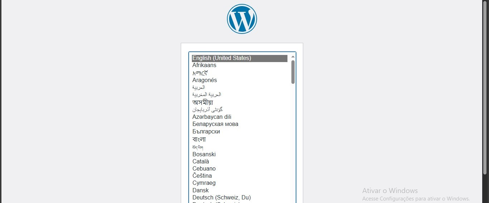

<p float="left">
  
  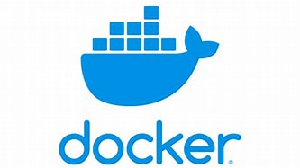
  
  
  
</p>


<h2>Compasso UOL 2024</h2>


